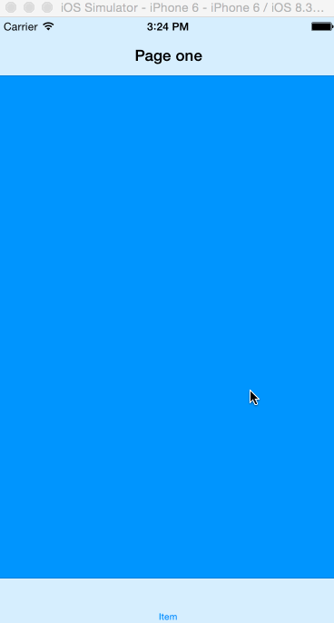
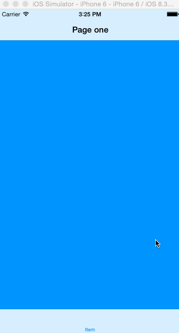
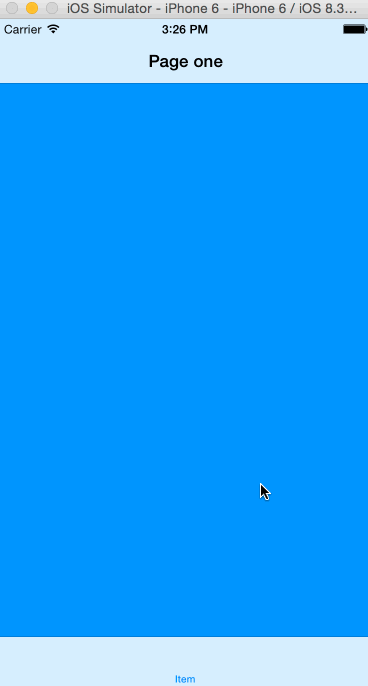

# CHXSwipeBackPopAnimator
Swipe back pop animation, not just trigger screen edge!

# How does it look like?

<p align="left">
	&nbsp;
	&nbsp;
	&nbsp;
</p>


## How to use

- add `pod CHXSwipeBackPopAnimator` your pod file
- run `pod update --no-repo-update --verbose`
- Edit you `UINavigationController` file
	
	```Objective-c
	#import "CHXPopAnimatorPayload.h"
	...
	@property (nonatomic, strong) CHXPopAnimatorPayload *payload;
	...
	self.payload = [[CHXPopAnimatorPayload alloc] initWithNavigationController:self];
    self.delegate = self.payload;
	```

## Requirements

- iOS 7
- ARC

# Refrence
	
- [onevcat's blog](http://onevcat.com/2013/10/vc-transition-in-ios7/)
- [nonamelive](https://github.com/nonamelive/SloppySwiper/blob/master/Classes/SSWAnimator.m#L67)
